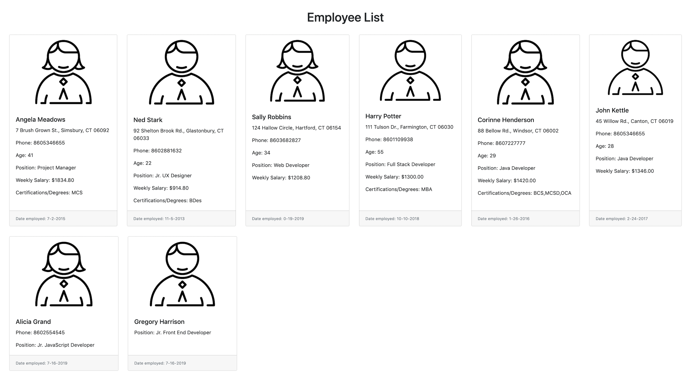
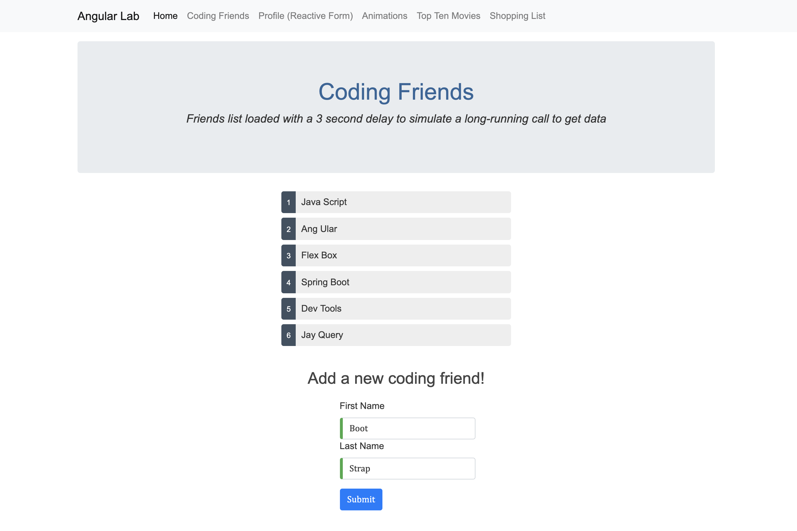
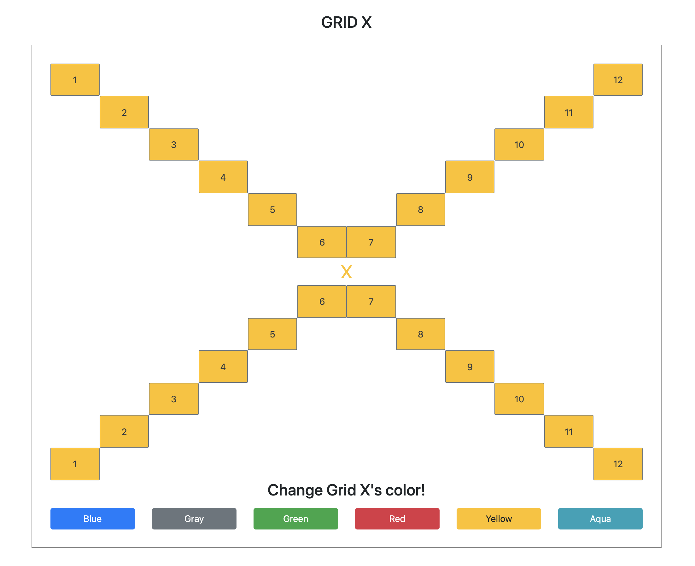
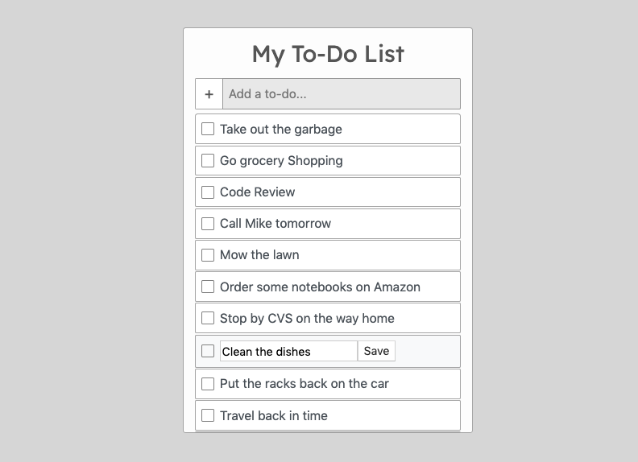

# Tech Talent Select

## Table of Contents
- [JavaScript Libraries Assignment](#tts-javascript-assignment---javascript-libraries)
- [TypeScript (Angular Basics) Assignment](#tts-javascript-assignment---typescript-angular-basics--live-demo)
- [Angular Labs Assignment Part 1](#tts-javascript-assignment---angular-labs)
- [Angular Labs Assignment Part 2 - Angular Tour of Heroes](#part-2---angular-tour-of-heroes)
- [Bootstrap & jQuery Assignment](#tts-javascript-assignment---bootstrap--jquery--live-demo)
- [TODO App Assignment](#tts-javascript-assignment---todo-app--live-demo)

## TTS JavaScript Assignment - JavaScript Libraries

- **Completed Lodash Exercises**   
    An example of one of my code solutions to a Lodash exercise:   
    ```
    /**
     * Instructions:
     * Using the documentation for the _.countBy() function
     * create statements that print out the number of residents in each state.
     */

    // My solution:
    const printNumOfResidentsPerState = () => _
        .chain(residents)
        .countBy(resident => resident.state)
        .forEach((value, key) => console.log(`There are ${value} residents living in ${key}.`))
        .value();

    printNumOfResidentsPerState();
    /* Output:
    There are 3 residents living in TX.
    There are 3 residents living in FL.
    There are 3 residents living in CO.
    There are 2 residents living in KS.
    There are 4 residents living in NC.
    */
    ``` 
    Lab File - [`js-lib-lab/lodash-lab.js`](js-lib-lab/lodash-lab.js)  
- **Completed Moment Exercises**  
Lab File - [`js-lib-lab/moment-lab.js`](js-lib-lab/moment-lab.js)  
- **Completed mathjs Exercises**  
Lab File - [`js-lib-lab/mathjs-lab.js`](js-lib-lab/mathjs-lab.js)  
- **Completed DataTable Lab**  
Lab Folder - [`js-lib-lab/data-table-lab`](js-lib-lab/data-table-lab)  
- **Completed Chart.js Lab**  
Lab File - [`js-lib-lab/chart.html`](js-lib-lab/chart.html)  
- **Completed React Lab**  
Lab File - [`js-lib-lab/react.html`](js-lib-lab/react.html)  
- **Completed Vue Lab**  
As instructed, completed following Vue's tutorial video ["An Introduction to Vue"](https://player.vimeo.com/video/247494684)  
Lab File - [`js-lib-lab/vue.html`](js-lib-lab/vue.html)  

## TTS JavaScript Assignment - TypeScript (Angular Basics) | [Live Demo](https://jordanmor.github.io/tts-js-assignments/typescript/)

**Lab/Homework Instructions**  
- Create an HTML file template and a TypeScript file. Compile the TypeScript file by to the proper folder in the command prompt and compile with the tsc command. Note the name of the produced JavaScript file. Reference the JavaScript file from the HTML page, then launch the HTML page in a browser to verify the output.
- Create a class called `Employee`. Give it the properties of first name, last name, age, phone number, state, zip code, and occupation. Create a constructor to initialize these properties. Also create several method to return combinations of interest, such as Full name, Name and Phone Number, Location, etc.
- Compile the file again with tsc to ensure the syntax is correct.
- Create several people and assign the output of some of their information to various sections in your page.
- Add a hourlyWage property to the employee. Add a function that calculates a weekly wage and takes the number of hours as an default parameter. If it is not presented, use a typical 40 hours to calculate the wage. Display this in a area that states the name of the person and their weekly wage.
- Create a property for a person's certifications/degrees that is an array. These could be things such as MBA, CSM, MCSD, etc. Next create a function called addCerts() that takes an unknown number of arguments and adds them to the array.
- Create an interface called EmployeeOptions where the name values are required but the other parameters are optional. Create a method in the class that takes an option parameter and returns an Employee based on the options given. Implement this will a few different options to observe how it works.
- Examine the compiled JavaScript file to see how the tsc changes TypeScript into JavaScript.

**Assignment folder**  
[`typescript`](typescript)  

**Screenshot of my completed TypeScript assignment**  

  

## TTS JavaScript Assignment - Angular Labs
### Part 1 - Angular Fundamentals - Routing, Services, Dependency Injection, Observables, Forms and Animation
#### **IMPORTANT PROJECT NOTE**: This Lab has been cloned and further developed in a separate repo for easier demonstration purposes. For a live demo of the updated project, please go to [tts-angular-project](https://jordanmor.github.io/tts-angular-project/)

**Lab/Homework Instructions**  
Build a simple Angular app using routing, services, dependency injection, observables, forms and animation   
- Create several components, modify the html templates to display something other than the default message, create a route for each new component and add a tag/link that goes to the page.
- Create and style pages links, either as horizontal or vertical items so they resemble a menu
- Make one of the components serve as the application default. Give it some additional "Welcome to the site" verbiage and make it the default route in the routing system.
- Create a simple Person class in the src/app folder. Some applications would also create this in a sub-folder called "models" or "domain-classes", it's entirely up to you.
- Generate a service class. Use the generate command option to NOT create a test file.
  - **NOTE** - I used the command ng g s --skipTests=true
- Display a list of people using the service class, dependency injection, and Observables.
- Add the delay function provided below to the service class to use inside the component's getPerson() method in order to simulate the process of Observables with a long web delay
  ```
  async delay(ms: number) {
    await new Promise(resolve => 
      setTimeout(()=>resolve(), ms));
  }
  ```
- In the ongoing project, create a component for entering new people. Use the template-based approach for wiring up a person model object.
- To simulate saving simply either display an alert when the form is submitted or console.log the values.
- Create another editing component, but use the reactive model for building the form.
- Create a class that has several properties, then create an editing component for that class. Use the FormBuilder to shorten the creation of the form.
- Create a button that is not part of the form. Code the button so that it will change the data in the model when pressed. With the form open, press the button to ensure that the data is refreshed on the form.
- In the AppModule, import the BrowserAnimationsModule.
- Create a new component simply to test the process to create animations. In the new component import the animation functions you will need (trigger, state, style, animate, transition).
- Add the animations property in the @Component declaration, create an animation to transition between to different states on a small area of the screen, such as a small div. Control the state via a simple button.
- Add logic to create more states via an enum - at least 3. Change the logic to switch states; create separate buttons for each state such that clicking the button will set the state property.

**Assignment folder**  
[`angular/angular-lab`](angular/angular-lab)  

**Screenshot from my completed Angular Lab assignment**  
<em>Friends list displayed using a service class, dependency injection, observables and a delay function that simulates a long-running call to get data from a server. A template-based form is used to add a new person to the list of coding friends when the form is submitted.</em>  

 

### Part 2 - Angular Tour of Heroes  

**Lab/Homework Instructions**  
- Go to the Angular.io site and work through the Angular Tour of Heroes app. Be sure to do the CLI-based version of the tutorial.
- Learn to set up a local development environment, use the Angular CLI tool, create Angular components, display and hide elements and lists, use one-way data binding for read-only data, add editable fields to update a model with two-way data binding, bind component methods to user events, format data with pipes, create and use shared services, use routing to navigate among different views and their components and add data persistence features with help from Angular's HttpClient.   

**Assignment folder**   
[`angular/angular-tour-of-heroes`](angular/angular-tour-of-heroes) 

## TTS JavaScript Assignment - Bootstrap & jQuery | [Live Demo](https://jordanmor.github.io/tts-js-assignments/bootstrap-jquery/)

**Lab/Homework Instructions**  
- Look at the list of components on the Bootstrap documentation, pick out a few of the components and code some simple sections
- Using div sections, create several message areas that have different background colors. Reference the bg- series of classes
- Use `<p>` tags and the text- classes to create several areas of colored text
- Combine the bg- and text- classes to make some custom alert-like sections
- (Table One) Create a basic table using `<div>` sections. Create simple custom border styles or use the built-in Bootstrap border classes and apply them alternating in each column.
- (Table Two) Add adaptive sizing. Change the col- classes to col-md- on various rows. Resize the browser and observe the behavior. Using the .offset classes, create a row that has space to the left and all the column content shown to the right.
- Create an input form using the form-group and form-control classes and add a primary button to the form.   
--- 
<strong>Instructions used to create Grid X</strong>  
- Using the justify-content- classes, create a grid that forms an "X" on the screen.
- Create a button on the page for changing colors. Code several iterations of the button and alter the color of the some of the sections you created earlier by adding or removing classes.

**Assignment folder**  
[`bootstrap-jquery`](bootstrap-jquery)  

**Screenshot of Grid X, created using Bootstrap as part of the Bootstrap & jQuery assignment**  

  

## TTS JavaScript Assignment - TODO App | [Live Demo](https://jordanmor.github.io/tts-js-assignments/todo-app/)

**Homework Instructions**  
Create a simple todo application
- Show an unordered list of todo's
- Show an input to enter a new todo
- Show a button to add a todo. When the button is clicked:
  - The text from the input box is used to add a list item to the bottom of the list
  - The text from the input box is cleared out.
- When the user clicks on a list item, it is removed
- Extra Credit: - When a list item is clicked, cross it out, then remove it after 1 second.

**Notes**   
Todo list was made mobile ready and responsive.  
Todos are editable  
Todo list is scrollable  
Custom-styled checkbox used for checking off a todo item  
When checked, the todo text is crossed out and selected todo is removed after 1 second

**Assignment folder**  
[`todo-app`](todo-app) 

**Screenshot of my completed Todo app**  



## TTS JavaScript Assignment - Slideshow | [Live Demo](https://jordanmor.github.io/tts-js-assignments/slideshow/)

**Lab/Homework Instructions**  
- Create a single object named slideshow that represents the data and functionality of a picture slideshow. There should be NO VARIABLES OUTSIDE THE OBJECT. The object should have properties for:
    - An array called photoList that contains the names of the photos as strings
    - An integer currentPhotoIndex that represents which photo in the photoList is currently displayed
    - A nextPhoto() function that moves currentPhotoIndex to the next index if there is one, and: 4. logs the current photo name. 4. Otherwise, log "End of slideshow";
    - A prevPhoto() function that does the same thing, but backwards.
    - A function getCurrentPhoto() that returns the current photo from the list.  

**My Assignment Notes**  
- I used a closure, short-circuiting and arrow functions for the slideshow logic
- I created a basic html page to display the slideshow functionality
- Refactored project logic:  
    ```
    const slideshow = () => {
        const photoList = [
            'https://place-hold.it/300/4287f5/fff/000.jpg?text=Picture%201', 
            'https://place-hold.it/300/4ef542/fff/000.jpg?text=Picture%202', 
            'https://place-hold.it/300/ed9c2b/fff/000.jpg?text=Picture%203', 
            'https://place-hold.it/300/9f18de/fff/000.jpg?text=Picture%204'
        ];
        let currentPhotoIndex = 0;

        return {
            nextPhoto: () => currentPhotoIndex < photoList.length - 1 && currentPhotoIndex++,
            prevPhoto: () => currentPhotoIndex > 0 && currentPhotoIndex--,
            getCurrentPhoto: () => photoList[currentPhotoIndex]
        }
    }
    ```

**Assignment folder**  
[`slideshow`](slideshow) 

# Tech Talent South

## TTS JavaScript Assignment - Rock, Paper, Scissors Game

**Instructions**  
1. Define a hands array with the values 'rock', 'paper', and 'scissors';
2. Define a function called getHand() that returns a hand from the array using parseInt(Math.random()*10)%3)
3. Define two objects for two players. Each player has name and getHand() properties.
4. Define a function called playRound() that
    - Takes two player objects as arguments
    - Gets hands from each
    - Determines the winner
    - Logs the hands played and name of the winner.
    - If its a tie, log the hands played and "it's a tie".
    - Returns the winner object (null if no winner)
5. Define a function called playGame() that takes arguments player1, player2, and playUntil.
    - Play rounds until one of the players wins playUntil hands
    - When one player has won enough games, return the winning player object
6. Play a game to 5 wins

<strong>Bonus Questions</strong>  
- Define a function called playTournament():  
- Take 4 players and playUntil as arguments  
- Play a game between the first two players, and the second two players  
- Play a game between the winners of the first round.  
- Announce the tournament winner's name "\[name] is the world champion"; 

**Assignment file**  
[`tech-talent-south/rock-paper-scissors.js`](tech-talent-south/rock-paper-scissors.js) 

## TTS JavaScript Assignment 1

**Instructions**  
1. Create a game of 'Rock Paper Scissors' that runs until one player has three wins.  
2. Store the player names and number of wins for each player in variables.  
3. Use a while loop to run the game until one player has 3 wins.  
4. Use the given data below to randomly select an item.  
5. Output each players hand to the console
    - Use an `if` or `switch` statement to determine a winner of the round
    - Output the round winner's name to the console
    - Create a way to track how many rounds each player has won
    - When one player wins 3 rounds, announce that player's name as the game winner
    - Push the code to your GitHub Repo

**Assignment files**  
[`tech-talent-south/assignment01_a.js`](tech-talent-south/assignment01_a.js) - assignment completed using functions  
[`tech-talent-south/assignment01_b.js`](tech-talent-south/assignment01_b.js) - At teacher's request, assignment was also completed without using functions or classes

## TTS JavaScript Assignment 2

Exercise 1  
- Use an array to keep track of your shopping list at the grocery store.  
- [Exercise 1 Instructions](https://github.com/ttsJavaScriptAppDevelopmentSummer16/classNotes/blob/master/Lesson%2002%20-%20Data%20Structures%20-%20Arrays%20&%20Objects.md#exercise-1)  

Exercise 2
- Given the following object, get the following values...
- [Exercise 2 Instructions](https://github.com/ttsJavaScriptAppDevelopmentSummer16/classNotes/blob/master/Lesson%2002%20-%20Data%20Structures%20-%20Arrays%20%26%20Objects.md#exercise-addressing-objects)

Exercise 3
- Create an object that models the data of your favorite email application. Add as much detail as you'd like. 
- Nest objects inside of arrays and arrays inside of objects multiple levels deep. Ask yourself if some of the primitives you've created could be objects instead. 
- Once you've composed your object, write some code to address it.
- Push the completed code to our GitHub channel.

**Assignment files**  
[`tech-talent-south/assignment02_1.js`](tech-talent-south/assignment02_1.js)    
[`tech-talent-south/assignment02_2.js`](tech-talent-south/assignment02_2.js)  
[`tech-talent-south/assignment02_3.js`](tech-talent-south/assignment02_3.js)  

## TTS JavaScript Assignment 3

**Instructions**
- Create an outer function with an inner function. Call the outer function.
- Declare two variables, a and b in the outer function's scope and set them to a string and an object respectively. Log their values immediately.
- Log the values of a and b in the inner function.
- Update the inner function to take two parameters named a and b.
- Pass a and b in as arguments when you execute inner().
- Inside the inner function, assign new values to a and b and log them at the end of the function AND after the execution of inner(a,b).
- Inside the inner function, update a property of the b object.

**Assignment file**  
[`tech-talent-south/assignment03.js`](tech-talent-south/assignment03.js)  

## TTS JavaScript Assignment 4

Exercise 1
1. Create an Array named superHeroes
    - Inside the superHeroes array create the following arrays: ["Batman", "Bruce Wayne"],["Spiderman", "Peter Parker"],["The Flash", "Barry Allen"]
2. Create a secretIdentity variable
3. Assign superHeroes.map() to the secretIdentity variable
4. Assign and anonymous function to superheroes.map() as an argument
5. Your anonymous function should have one parameter named revealArray
6. Inside the block of your anonymous function:
    - You'll be working with revealArray as an argument
    - Using revealArray return a string that will join the two array items.
    - Join them together with the string "is", ie: "Batman is Bruce Wayne"
7. Log the results to the screen and join them with a line break.

Exercise 2
1. Using the following data:
    - const players = [
        {firstName: 'Cam', lastName: 'Newton', position: 'QB', touchdowns: 32},
        {firstName: 'Derek', lastName: 'Anderson', position: 'QB', touchdowns: 0},
        {firstName: 'Jonathan', lastName: 'Stewart', position: 'RB', touchdowns: 12},
        {firstName: 'Mike', lastName: 'Tolbert', position: 'RB', touchdowns: 8},
        {firstName: 'Fozzy', lastName: 'Whittaker', position: 'RB', touchdowns: 3},
        {firstName: 'Ted', lastName: 'Ginn', position: 'WR', touchdowns: 9},
        {firstName: 'Devin', lastName: 'Funchess', position: 'WR', touchdowns: 2}
    ];
2. Find a player with the name 'Mike'
3. Get an array of all players with position 'RB'
4. Get an array of all the players lastNames
5. Get an array of the full names of all the runningbacks with more than 5 touchdowns
6. Get the number of touchdowns scored by Runningbacks

Exercise 3  
- Going back to our slideshow object, let's add some functionality.
    1. Create an empty property named playInterval
    2. A play() function that moves to the next photo ever 2000ms until the end. <em>Tip - use playInterval = setInterval(fn,ms).</em>
    3. A pause() function that stops the slideshow <em>Tip - use clearInterval(playInterval)</em>
    4. Automatically pause the slideshow if it gets to the end of the photolist while playing.

**Assignment files**  
[`tech-talent-south/assignment04_1.js`](tech-talent-south/assignment04_1.js)  
[`tech-talent-south/assignment04_2.js`](tech-talent-south/assignment04_2.js)  
[`tech-talent-south/assignment04_3.js`](tech-talent-south/assignment04_3.js)