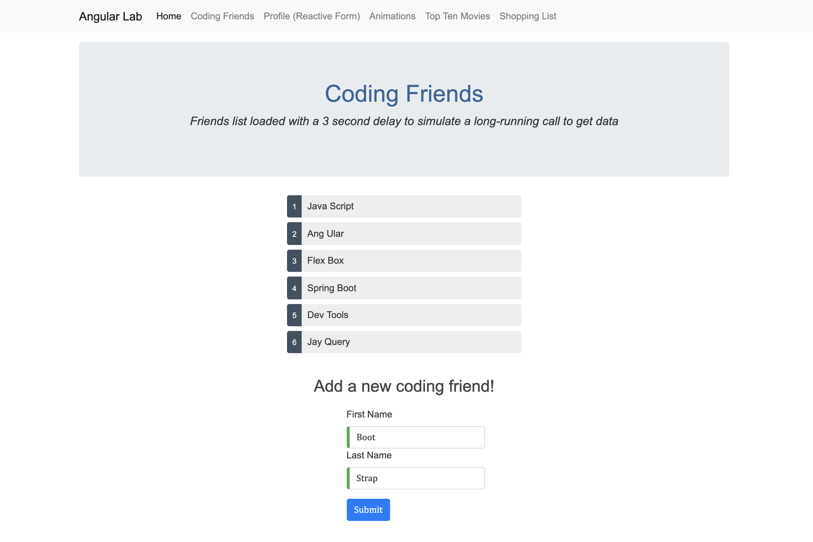

## TTS Assignment - Angular Lab | [Live Demo](https://jordanmor.github.io/angular-lab-demo/)
### Part 1 - Angular Fundamentals - Routing, Services, Dependency Injection, Observables, Forms and Animation

Name: Jordan Mor  
Assignment Title: Angular Services Lab-Homework Part 1 (Day 19 & 20)  
Assigned: 8/15/19 - 8/16/19 (Day 19 & 20 Bootcamp - Week 4)  
[Github Repo](https://github.com/jordanmor/tts-js-assignments) 

**Lab/Homework Instructions**   
Build a simple Angular app using routing, services, dependency injection, observables, forms and animation.   
- Create several components, modify the html templates to display something other than the default message, create a route for each new component and add a tag/link that goes to the page.
- Create and style pages links, either as horizontal or vertical items so they resemble a menu
- Make one of the components serve as the application default. Give it some additional "Welcome to the site" verbiage and make it the default route in the routing system.
- Create a simple Person class in the src/app folder. Some applications would also create this in a sub-folder called "models" or "domain-classes", it's entirely up to you.
- Generate a service class. Use the generate command option to NOT create a test file.
  - **NOTE** - I used the command ng g s --skipTests=true
- Display a list of people using the service class, dependency injection, and Observables.
- Add the delay function provided below to the service class to use inside the component's getPerson() method in order to simulate the process of Observables with a long web delay
  ```
  async delay(ms: number) {
    await new Promise(resolve => 
      setTimeout(()=>resolve(), ms));
  }
  ```
- In the ongoing project, create a component for entering new people. Use the template-based approach for wiring up a person model object.
- To simulate saving simply either display an alert when the form is submitted or console.log the values.
- Create another editing component, but use the reactive model for building the form.
- Create a class that has several properties, then create an editing component for that class. Use the FormBuilder to shorten the creation of the form.
- Create a button that is not part of the form. Code the button so that it will change the data in the model when pressed. With the form open, press the button to ensure that the data is refreshed on the form.
- In the AppModule, import the BrowserAnimationsModule.
- Create a new component simply to test the process to create animations. In the new component import the animation functions you will need (trigger, state, style, animate, transition).
- Add the animations property in the @Component declaration, create an animation to transition between to different states on a small area of the screen, such as a small div. Control the state via a simple button.
- Add logic to create more states via an enum - at least 3. Change the logic to switch states; create separate buttons for each state such that clicking the button will set the state property.

**Screenshot from my completed Angular Lab assignment**  
<em>Friends list displayed using a service class, dependency injection, observables and a delay function that simulates a long-running call to get data from a server. A template-based form is used to add a new person to the list of coding friends when the form is submitted.</em>  

  

---

This project was generated with [Angular CLI](https://github.com/angular/angular-cli) version 8.2.0.

## Development server

Run `ng serve` for a dev server. Navigate to `http://localhost:4200/`. The app will automatically reload if you change any of the source files.

## Code scaffolding

Run `ng generate component component-name` to generate a new component. You can also use `ng generate directive|pipe|service|class|guard|interface|enum|module`.

## Build

Run `ng build` to build the project. The build artifacts will be stored in the `dist/` directory. Use the `--prod` flag for a production build.

To get more help on the Angular CLI use `ng help` or go check out the [Angular CLI README](https://github.com/angular/angular-cli/blob/master/README.md).
