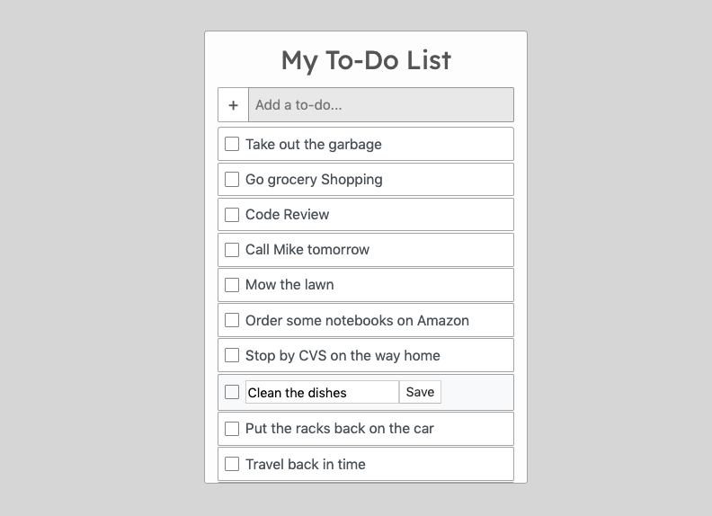

## TTS JavaScript Assignment - TODO App

Name: Jordan Mor  
Assignment Title: TODO App - Homework (Day 14)  
Assigned: 8/8/19 (Day 14 Bootcamp - Week 3)  

**Homework Instructions**  
Create a simple todo application
- Show an unordered list of todos
- Show an input to enter a new todo
- Show a button to add a todo. When the button is clicked:
  - The text from the input box is used to add a list item to the bottom of the list
  - The text from the input box is cleared out.
- When the user clicks on a list item, it is removed
- Extra Credit: - When a list item is clicked, cross it out, then remove it after 1 second.

**Notes**   
Todo app was made mobile ready and responsive.  
Todos are editable  
Todo app is scrollable  
Custom-styled checkbox used for checking off a todo item  
When checked, the todo text is crossed out and selected todo is removed after 1 second 

**Screenshot of my completed Todo app**  

