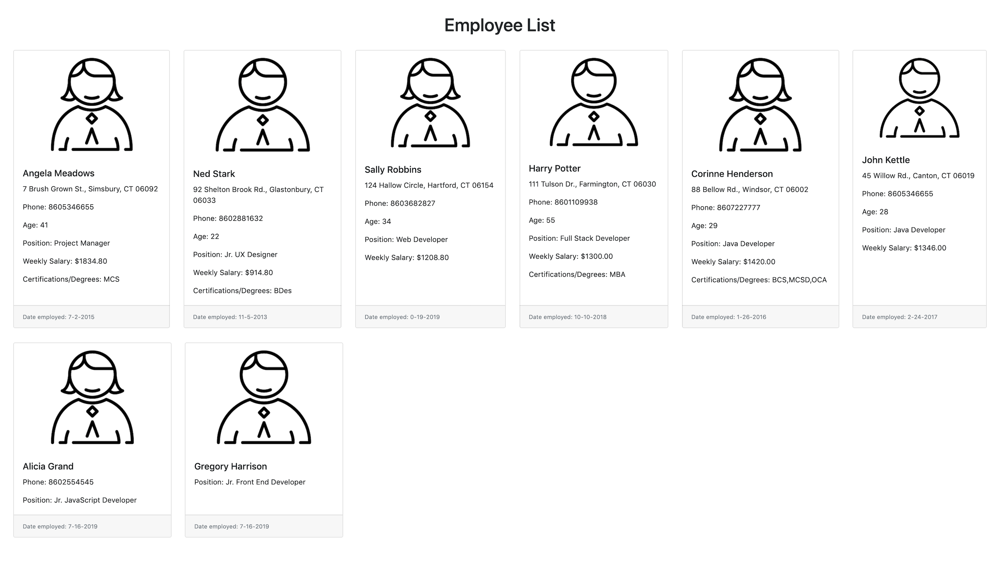

## TTS Assignment - TypeScript (Angular Basics)

- Create an HTML file template and a TypeScript file. Compile the TypeScript file by to the proper folder in the command prompt and compile with the tsc command. Note the name of the produced JavaScript file. Reference the JavaScript file from the HTML page, then launch the HTML page in a browser to verify the output.
- Create a class called `Employee`. Give it the properties of first name, last name, age, phone number, state, zip code, and occupation. Create a constructor to initialize these properties. Also create several method to return combinations of interest, such as Full name, Name and Phone Number, Location, etc.
- Compile the file again with tsc to ensure the syntax is correct.
- Create several people and assign the output of some of their information to various sections in your page.
- Add a hourlyWage property to the employee. Add a function that calculates a weekly wage and takes the number of hours as an default parameter. If it is not presented, use a typical 40 hours to calculate the wage. Display this in a area that states the name of the person and their weekly wage.
- Create a property for a person's certifications/degrees that is an array. These could be things such as MBA, CSM, MCSD, etc. Next create a function called addCerts() that takes an unknown number of arguments and adds them to the array.
- Create an interface called EmployeeOptions where the name values are required but the other parameters are optional. Create a method in the class that takes an option parameter and returns an Employee based on the options given. Implement this will a few different options to observe how it works.
- Examine the compiled JavaScript file to see how the tsc changes TypeScript into JavaScript.

**Screenshot of my completed TypeScript assignment**  

